# Yellow Taxi NYC — Christmas Season Demands

Análisis de datos masivos de movilidad urbana en Nueva York durante la temporada navideña de diciembre (2023-2025), usando una arquitectura Lambda sobre Google Cloud Platform para identificar zonas de alto poder adquisitivo y hotspots de demanda.

**Asignatura:** Big Data — BIY7131  
**Institución:** DuocUC  
**Profesor:** Igor Venegas  
**Entrega:** 24/05/2026

| Alumno | Correo |
|---|---|
| Patricio González | pata.gonzalez@duocuc.cl |
| Rodrigo Riveros | rodr.riveros@duocuc.cl |
| Nicolás Zamora | nic.zamora@duocuc.cl |

---

## Descripción del Proyecto

**Empresa/Organización:** NYC Mobility Analytics Group  
**Proyecto:** Christmas Season Demands

El objetivo es responder una pregunta crítica de negocio: **¿dónde y cuándo desplegar taxis con publicidad de subastas tecnológicas para maximizar el impacto visual ante el público con mayor poder adquisitivo y alta intención de compra?**

Se analizaron los datos históricos de Yellow Taxi NYC correspondientes a la **segunda y tercera semana de diciembre** de los años 2023, 2024 y 2025, aplicando cuatro análisis estratégicos:

1. Zonas de alto poder adquisitivo (tarifa base elevada sin peajes)
2. Top 10 zonas con mayor gasto total promedio (viajes premium)
3. Zonas de origen con mayor flujo hacia aeropuertos (JFK/Newark)
4. Hotspot navideño: máxima concentración peatonal en horario comercial

---

## Arquitectura

Se adoptó una **Arquitectura Lambda adaptada** que incorpora una capa de visualización para cerrar el ciclo de vida del dato.

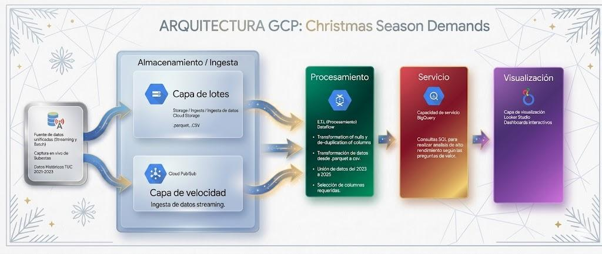

| Capa | Servicio GCP | Función |
|---|---|---|
| **Lotes** | Cloud Storage | Datalake — almacena archivos `.parquet` históricos (2023-2025) |
| **Velocidad** | Cloud Pub/Sub | Ingesta de eventos en tiempo real de forma asíncrona |
| **Procesamiento** | Cloud Dataflow | ETL: limpieza, transformación y unificación de rutas batch/stream |
| **Servicio** | BigQuery | Data Warehouse — consultas SQL analíticas sobre millones de registros |
| **Visualización** | Looker Studio | Dashboards interactivos conectados directamente a BigQuery |

---

## Estructura del Proyecto

```
.
├── docs/
│   └── INFORME.docx              # Informe técnico completo
├── images/
│   ├── arquitectura/             # Diagrama de arquitectura
│   ├── cloud-storage/            # Configuración del bucket (16 imágenes)
│   ├── dataflow/                 # Implementación del ETL (18 imágenes)
│   ├── bigquery/                 # Consultas y resultados (12 imágenes)
│   └── looker-studio/            # Dashboard interactivo (33 imágenes)
└── scripts/
    ├── preprocessing/
    │   └── preprocesar_diciembre.py   # Script Python de preprocesamiento
    └── sql/
        ├── 01_zonas_alto_poder_adquisitivo.sql
        ├── 02_viajes_top10_premium.sql
        ├── 03_tarifas_aeropuertos.sql
        ├── 04_hotspot_navideno.sql
        ├── 05_transformacion_dataflow.sql
        └── 06_consulta_geoespacial_looker.sql
```

---

## Implementación

### 1. Cloud Storage — Ingesta y Almacenamiento

Se creó el bucket `datos_batch_2023_2025` con las siguientes configuraciones:

- **Tipo de ubicación:** Multi-región (`us`)
- **Clase de almacenamiento:** Standard (acceso frecuente para procesamiento inmediato)
- **Control de acceso:** Uniforme via IAM
- **Protección:** Eliminación no definitiva activada (retención 7 días)
- **Encriptación:** Clave administrada por Google (CMEK)

Los tres archivos `.parquet` (2023, 2024 y 2025) se cargaron directamente al bucket.

| Paso | Imagen |
|---|---|
| Creación y nombrado del bucket | 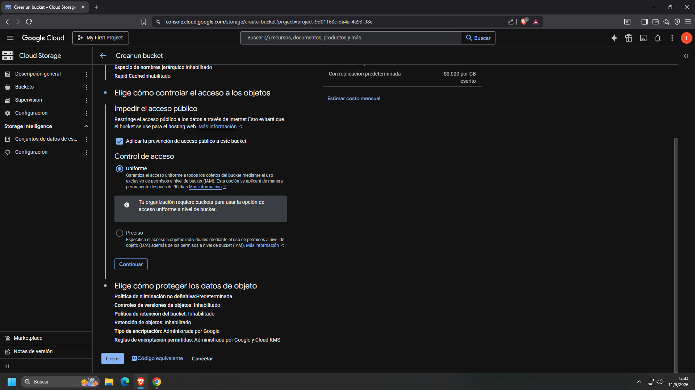 |
| Definición de ubicación multi-región | 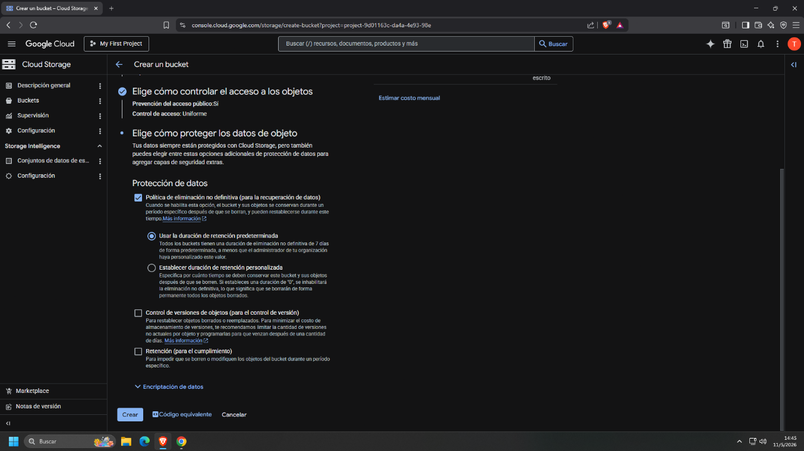 |
| Clase de almacenamiento Standard | 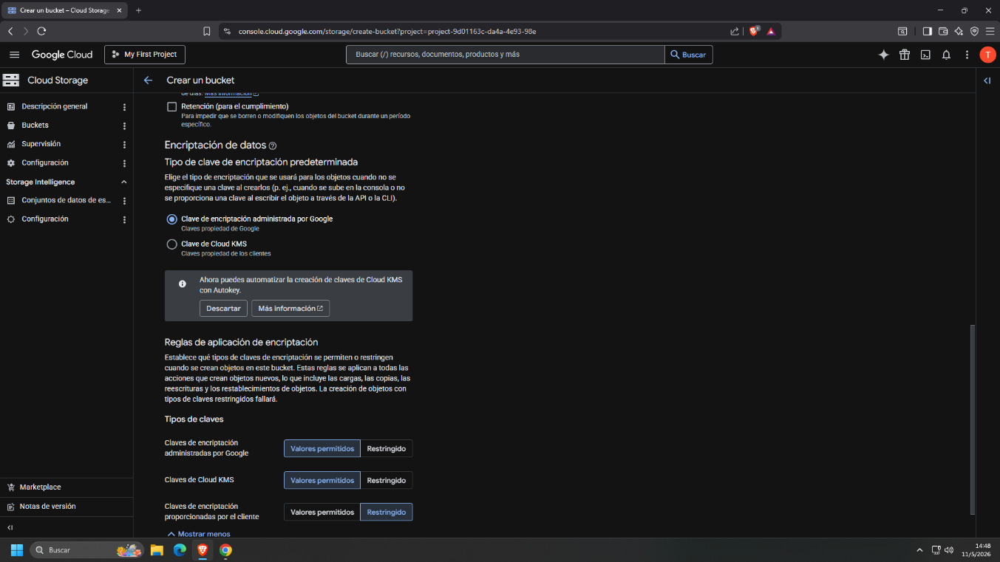 |
| Control de acceso uniforme | 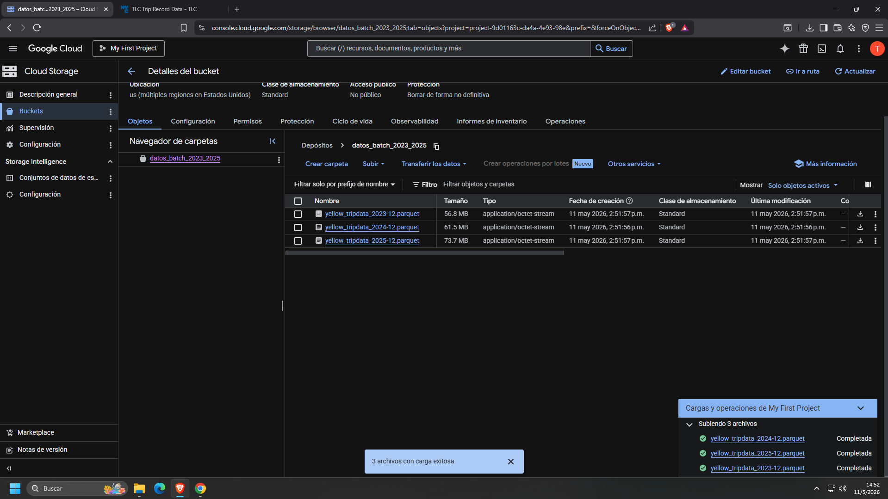 |
| Protección de datos | 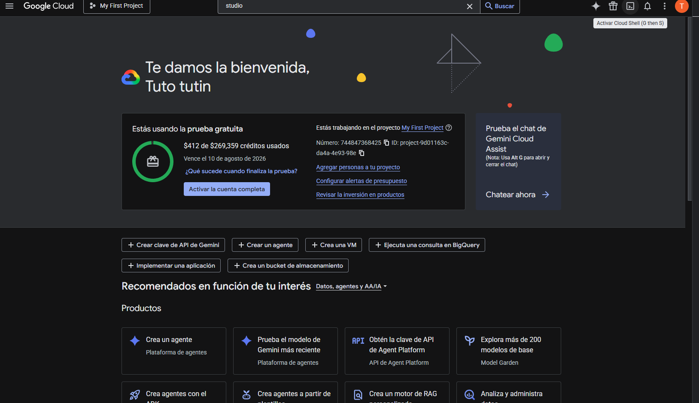 |
| Encriptación | 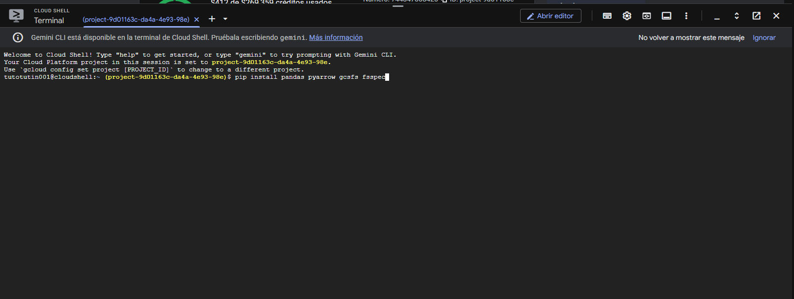 |
| Archivos .parquet cargados | 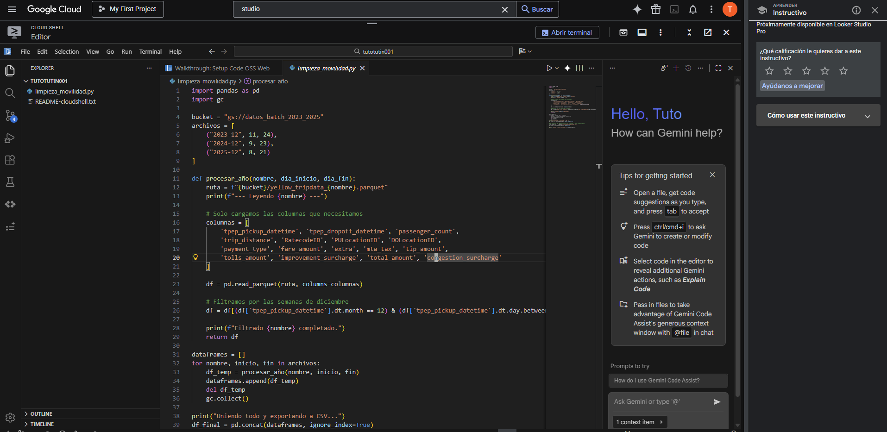 |

---

### 2. Dataflow — Procesamiento ETL

#### 2.1 Preprocesamiento con Python (Cloud Shell)

Se ejecutó un script Python en Cloud Shell que:
1. **Extrae** los archivos `.parquet` desde GCS cargando solo las columnas necesarias
2. **Filtra** los registros de las semanas de diciembre de cada año
3. **Une y exporta** los tres años en un único archivo `diciembre_final.csv`

> Los archivos `.parquet` originales tienen timestamps con milisegundos que Dataflow no puede procesar directamente, por eso se convirtieron primero a CSV.

```bash
pip install pandas pyarrow gcsfs fsspec
python preprocesar_diciembre.py
```

Ver script completo: [`scripts/preprocessing/preprocesar_diciembre.py`](scripts/preprocessing/preprocesar_diciembre.py)

#### 2.2 Permisos IAM

Se asignaron los siguientes roles a la cuenta de servicio de Compute Engine:

- Administrador de almacenamiento
- Editor de Cloud Build
- Editor de datos de BigQuery
- Escritor de Artifact Registry
- Trabajador de Dataflow
- Usuario de trabajo de BigQuery

#### 2.3 Trabajo en Dataflow

Se usó la plantilla oficial **"CSV Files on Cloud Storage to BigQuery"** con la siguiente ruta de origen:

```
gs://datos_batch_2023_2025/procesado/diciembre_final.csv
```

#### 2.4 Transformación SQL en Dataflow

Se aplicó una transformación SQL sobre el stream `PCOLLECTION` para limpiar y seleccionar columnas:

```sql
SELECT
    tpep_pickup_datetime,
    tpep_dropoff_datetime,
    PULocationID,
    DOLocationID,
    store_and_fwd_flag,
    COALESCE(RatecodeID, 99)          AS RatecodeID_limpio,
    fare_amount,
    COALESCE(congestion_surcharge, 0) AS congestion_surcharge_limpio,
    tolls_amount,
    total_amount
FROM PCOLLECTION
```

El destino se configuró en **BigQuery** (dataset `datos_historicos`, tabla `diciembre_yellow_taxi`) con la región `southamerica-west1` (Santiago). El ETL completó en **~13 minutos**.

| Paso | Imagen |
|---|---|
| Activación Cloud Shell | 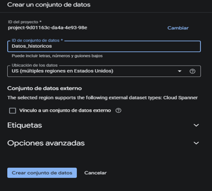 |
| Script Python en editor | 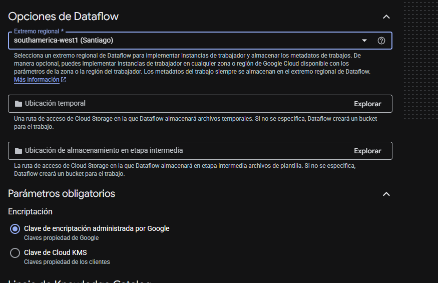 |
| Carpeta `procesado/` creada | 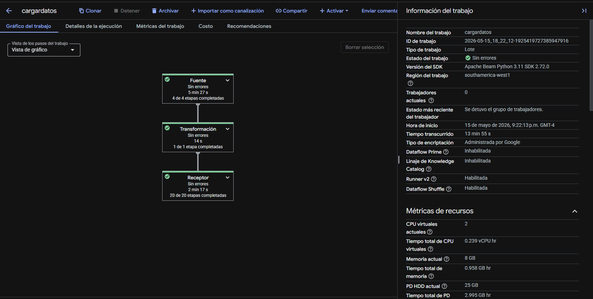 |
| Permisos IAM asignados | 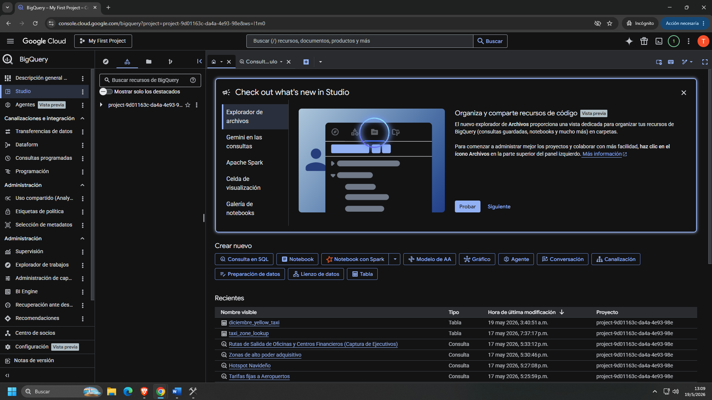 |
| Creación trabajo Dataflow | 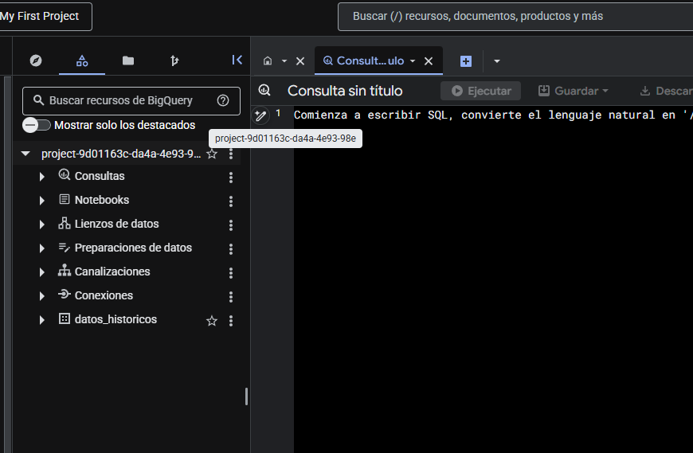 |
| Transformación SQL | 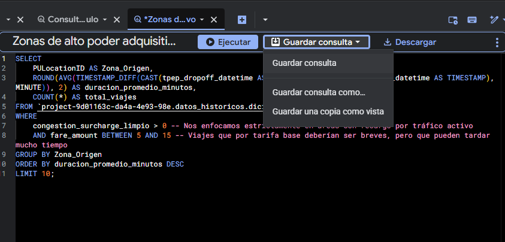 |
| ETL completado exitosamente |  |

---

### 3. BigQuery — Capa de Servicios

Se ejecutaron y guardaron cuatro consultas analíticas sobre `datos_historicos.diciembre_yellow_taxi`:

#### Consulta 1 — Zonas de Alto Poder Adquisitivo

```sql
SELECT
    PULocationID AS Zona_Origen,
    ROUND(AVG(fare_amount), 2)  AS tarifa_base_promedio,
    ROUND(AVG(total_amount), 2) AS gasto_total_promedio,
    COUNT(*) AS cantidad_viajes
FROM `<PROJECT_ID>.datos_historicos.diciembre_yellow_taxi`
WHERE tolls_amount = 0 AND fare_amount > 15
GROUP BY Zona_Origen
HAVING cantidad_viajes > 100
ORDER BY tarifa_base_promedio DESC
LIMIT 10;
```

#### Consulta 2 — Top 10 Viajes Premium (Mayor Gasto)

```sql
SELECT
    PULocationID AS Zona_Origen,
    ROUND(AVG(total_amount), 2) AS costo_promedio,
    ROUND(MAX(total_amount), 2) AS costo_maximo,
    COUNT(*) AS cantidad_viajes
FROM `<PROJECT_ID>.datos_historicos.diciembre_yellow_taxi`
WHERE total_amount > 0
GROUP BY Zona_Origen
HAVING cantidad_viajes > 50
ORDER BY costo_promedio DESC
LIMIT 10;
```

#### Consulta 3 — Tarifas a Aeropuertos

```sql
SELECT
    PULocationID AS Zona_Origen,
    COUNT(*) AS cantidad_viajes_aeropuertos
FROM `<PROJECT_ID>.datos_historicos.diciembre_yellow_taxi`
WHERE RatecodeID_limpio IN (2.0, 3.0)
GROUP BY Zona_Origen
ORDER BY cantidad_viajes_aeropuertos DESC
LIMIT 10;
```

#### Consulta 4 — Hotspot Navideño

```sql
SELECT
    PULocationID AS Zona_Origen,
    COUNT(*) AS total_viajes,
    ROUND(AVG(total_amount), 2) AS tarifa_promedio
FROM `<PROJECT_ID>.datos_historicos.diciembre_yellow_taxi`
WHERE
    EXTRACT(DAY  FROM CAST(tpep_pickup_datetime AS TIMESTAMP)) BETWEEN 10 AND 24
    AND EXTRACT(HOUR FROM CAST(tpep_pickup_datetime AS TIMESTAMP)) BETWEEN 12 AND 21
GROUP BY Zona_Origen
ORDER BY total_viajes DESC
LIMIT 10;
```

Ver todas las consultas en: [`scripts/sql/`](scripts/sql/)

| Consulta | Imagen resultado |
|---|---|
| Zonas alto poder adquisitivo | 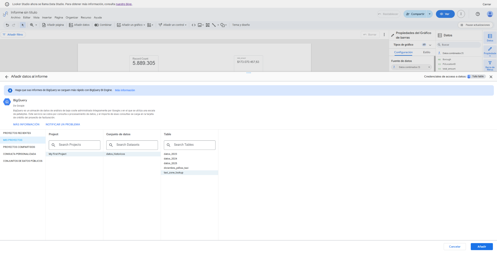 |
| Viajes premium Top 10 | 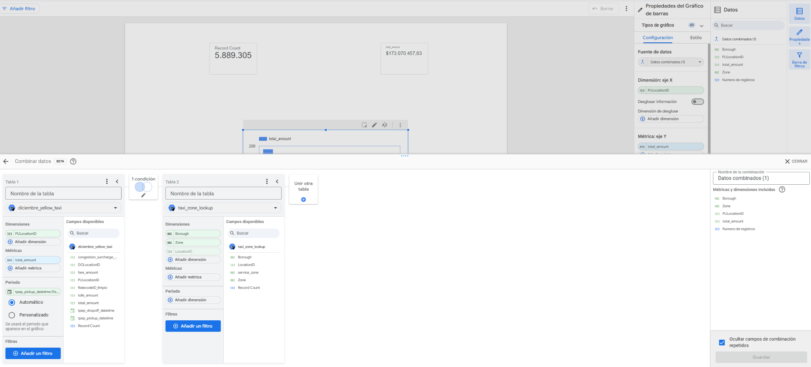 |
| Tarifas aeropuertos | 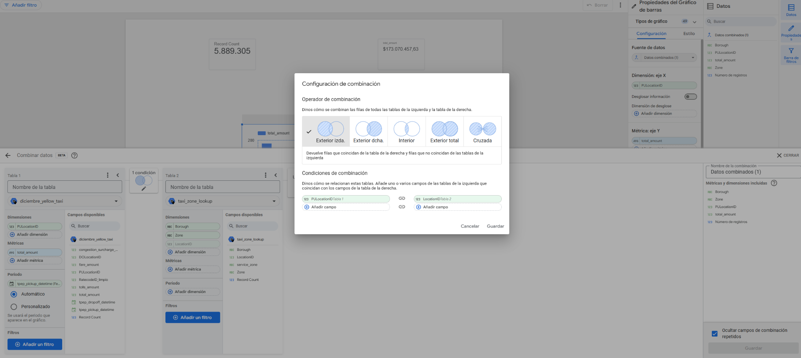 |
| Hotspot navideño | 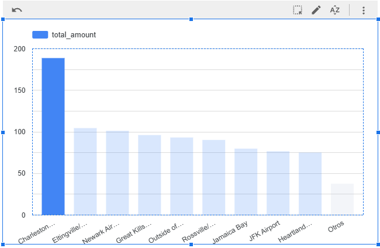 |

---

### 4. Looker Studio — Visualización

El dashboard se construyó conectando Looker Studio directamente a la tabla `diciembre_yellow_taxi` en BigQuery.

#### Enriquecimiento de datos
Se descargó el archivo `taxi_zone_lookup.csv` para traducir los `LocationID` numéricos a nombres de barrios y distritos. Se combinaron las tablas en Looker Studio con unión exterior izquierda (`PULocationID` ↔ `LocationID`).

#### Mapa coroplético geoespacial
Para el mapa de calor de zonas de destino se requirió convertir el shapefile de zonas de taxi a formato **WKT** (EPSG:4326) usando [mygeodata.cloud](https://mygeodata.cloud/), cargar la tabla a BigQuery, y usar una **consulta personalizada** para los datos geoespaciales:

```sql
SELECT
    viajes.*,
    ST_GEOGFROMTEXT(geo_destino.WKT) AS poligonos,
    geo_destino.zone AS nombre_destino,
    geo_origen.zone  AS nombre_origen
FROM `<PROJECT_ID>.datos_historicos.diciembre_yellow_taxi` AS viajes
LEFT JOIN `<PROJECT_ID>.datos_historicos.taxi_zone_oficial` AS geo_destino
    ON CAST(viajes.DOLocationID AS STRING) = CAST(geo_destino.LocationID AS STRING)
LEFT JOIN `<PROJECT_ID>.datos_historicos.taxi_zone_oficial` AS geo_origen
    ON CAST(viajes.PULocationID AS STRING) = CAST(geo_origen.LocationID AS STRING)
```

#### Componentes del dashboard

| Componente | Descripción |
|---|---|
| KPI — Viajes totales | `Record Count` |
| KPI — Gasto promedio | `AVG(total_amount)` en USD |
| KPI — Gasto total | `SUM(total_amount)` en USD |
| KPI — Duración promedio | `DATETIME_DIFF(dropoff, pickup, MINUTE)` |
| Gráfico de barras | Top 10 zonas de origen por volumen de viajes |
| Gráfico de líneas | Distribución horaria de demanda (00:00 - 23:00) |
| Gráfico de líneas | Distribución por día de la semana |
| Mapa coroplético | Densidad de destinos por zona geográfica |
| Filtro desplegable | Destino (Top 5 zonas más relevantes) |
| Filtro desplegable | Año (2023 / 2024 / 2025) |

| Vista | Imagen |
|---|---|
| Dashboard completo | 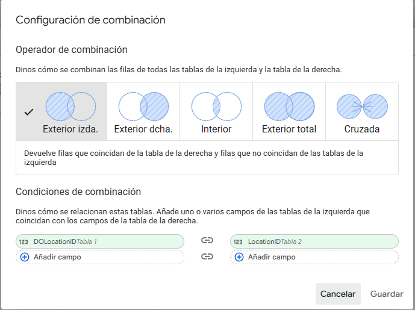 |
| Gráfico zonas premium | 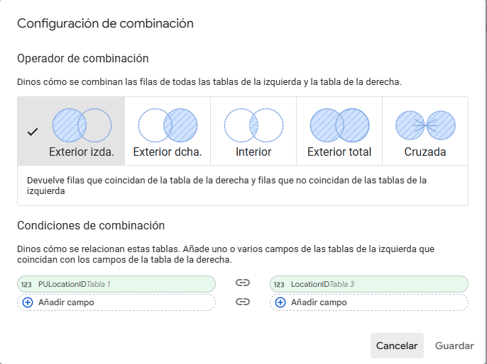 |
| Mapa de calor | 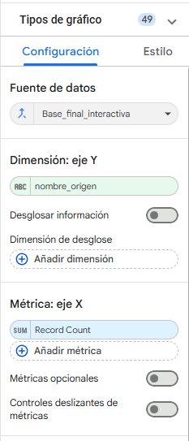 |
| Distribución horaria | 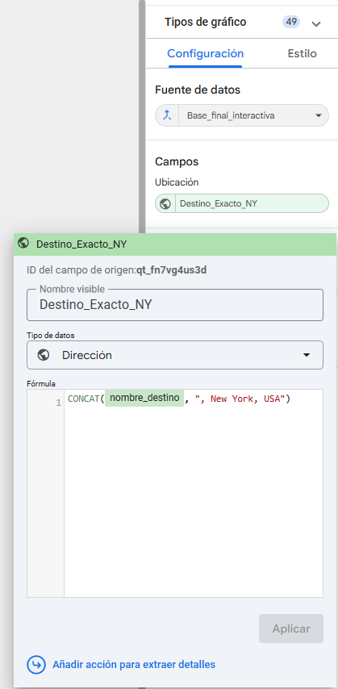 |
| Filtros interactivos | 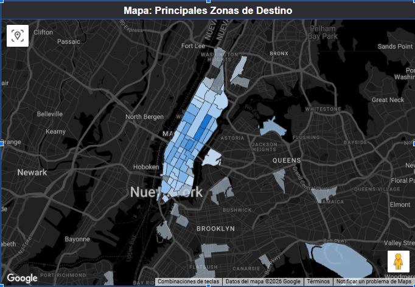 |

Ver todas las capturas en: [`images/looker-studio/`](images/looker-studio/)

---

## Propuesta de Valor

**Garantizamos a nuestro cliente que la publicidad de sus subastas de productos electrónicos no circulará al azar.**

Mediante el análisis de movilidad histórica, identificamos:

- Las **zonas geográficas** donde transita el segmento de mayor disposición a pagar
- Los **horarios óptimos** de mayor densidad del público objetivo
- Los **días críticos** de la temporada navideña con mayor afluencia comercial
- Los **corredores aeroportuarios** frecuentados por ejecutivos y viajeros de negocios

El resultado es un **sistema de enrutamiento inteligente** que dirige la flota de taxis publicitarios exactamente hacia los hotspots premium en tiempo real, maximizando la visibilidad ante el comprador correcto y elevando el retorno de inversión de la campaña.

---

## Tecnologías Utilizadas


- **Google Cloud Storage** — Datalake / almacenamiento de archivos Parquet
- **Google Cloud Pub/Sub** — Ingesta de datos en tiempo real
- **Google Cloud Dataflow** — ETL distribuido (Apache Beam)
- **Google BigQuery** — Data Warehouse y motor de consultas SQL
- **Google Looker Studio** — Visualización y dashboards interactivos
- **Python / Pandas / PyArrow** — Preprocesamiento de datos
- **SQL** — Transformaciones y análisis analítico

---

## Trabajo Pendiente — Capa de Streaming

> **Próximamente:** Se incorporará la documentación e implementación completa de la capa de velocidad (streaming) del proyecto.

Esta sección cubrirá:

- Configuración detallada de **Google Cloud Pub/Sub** como broker de mensajes para la ingesta de eventos en tiempo real
- Publicación y consumo de mensajes simulando el flujo en vivo de viajes activos
- Integración del stream con **Cloud Dataflow** para el procesamiento unificado con la ruta batch (arquitectura Lambda)
- Scripts de producer/consumer en Python para el pipeline de streaming
- Resultados y análisis derivados de los datos en tiempo real
