# Yellow Taxi NYC - Christmas Season Demands

Análisis de datos masivos de movilidad urbana en Nueva York durante la temporada navideña de diciembre (2023-2025), usando una **arquitectura Lambda** sobre Google Cloud Platform que integra un flujo histórico por lotes (Batch) con un flujo de transacciones en tiempo real (Streaming) para identificar zonas de alto poder adquisitivo, hotspots de demanda y el momento óptimo de activación publicitaria.

**Asignatura:** Big Data — BIY7131  
**Institución:** DuocUC  
**Profesor:** Igor Venegas  


| Alumno | Correo |
|---|---|
| Patricio González | pata.gonzalez@duocuc.cl |
| Rodrigo Riveros | rodr.riveros@duocuc.cl |
| Nicolás Zamora | nic.zamora@duocuc.cl |

---

## Descripción del Proyecto

**Empresa/Organización:** NYC Mobility Analytics Group  
**Proyecto:** Christmas Season Demands

El objetivo es responder una pregunta crítica de negocio: **¿dónde y cuándo desplegar taxis con publicidad de subastas tecnológicas para maximizar el impacto visual ante el público con mayor poder adquisitivo y alta intención de compra?**

El proyecto integra dos flujos de datos complementarios:

- **Flujo Batch:** datos históricos de Yellow Taxi NYC correspondientes a la **segunda y tercera semana de diciembre** de los años 2023, 2024 y 2025, aplicando cuatro análisis estratégicos:
  1. Zonas de alto poder adquisitivo (tarifa base elevada sin peajes)
  2. Top 10 zonas con mayor gasto total promedio (viajes premium)
  3. Zonas de origen con mayor flujo hacia aeropuertos (JFK/Newark)
  4. Hotspot navideño: máxima concentración peatonal en horario comercial
- **Flujo Streaming:** eventos en vivo de un portal externo de subastas navideñas de productos electrónicos (transacciones vía POST/JSON), capturados y disponibilizados en tiempo casi real para validar si los hotspots históricos están **activos y receptivos** en el momento presente, actuando como gatillo temporal de las campañas OOH (Out-Of-Home).

### Justificación Big Data — Las 5 V

| V | Aplicación al caso |
|---|---|
| **Volumen** | Millones de registros de Yellow Taxi por diciembre analizado (2023-2025), sumados al flujo continuo de transacciones en vivo. |
| **Velocidad** | Miles de transacciones por minuto en taxis y eventos en vivo del portal de subastas; el pipeline streaming publica, transforma y carga cada mensaje en BigQuery en cuestión de segundos. |
| **Variedad** | Datos estructurados columnares `.parquet` (fechas, zonas, tarifas, distancias) conviven con mensajes JSON transaccionales (clientes, productos, montos, formas de pago). |
| **Veracidad** | El dataset de Yellow Taxi presenta distancias en cero, tarifas negativas, nulos y duplicados, resueltos en Dataflow; el webhook streaming valida el JSON entrante (error 400 si es inválido) y el modo *Exactamente una vez* evita duplicados y pérdidas. |
| **Valor** | Los datos históricos revelan **dónde** se localiza el consumidor premium (Hotspots) y los datos en vivo indican **cuándo** impactar con la campaña, optimizando la asignación de flota y el retorno de inversión. |

---

## Arquitectura

Se adoptó una **Arquitectura Lambda** sobre servicios administrados de Google Cloud Platform, con una ruta de lotes para el histórico, una ruta de velocidad para los eventos en vivo, una capa de servicio unificada en BigQuery y una capa de visualización en Looker Studio.

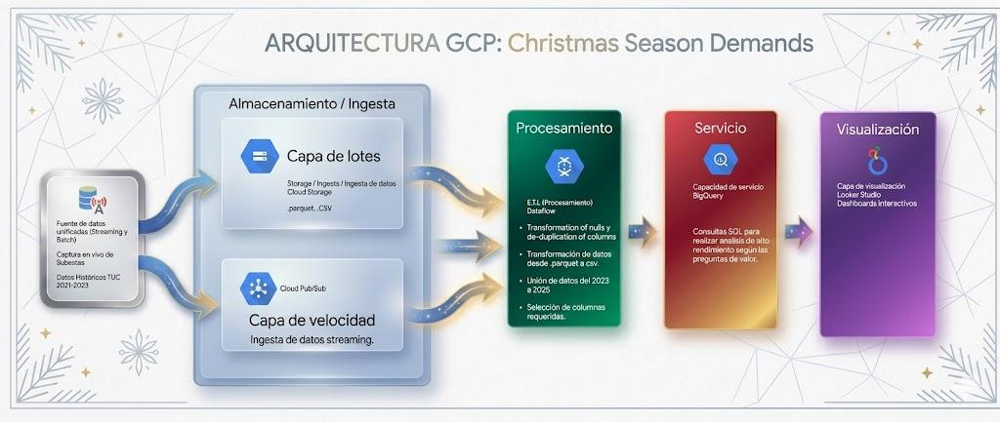

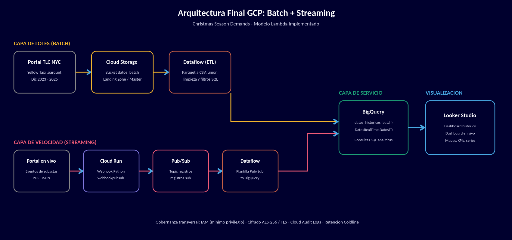

| Capa | Servicio GCP | Función |
|---|---|---|
| **Lotes** | Cloud Storage | Datalake — almacena archivos `.parquet` históricos (2023-2025) |
| **Velocidad** | Cloud Run + Cloud Pub/Sub | Webhook HTTP que valida y publica eventos en vivo de forma asíncrona |
| **Procesamiento** | Cloud Dataflow | ETL: limpieza, transformación y unificación de rutas batch/stream |
| **Servicio** | BigQuery | Data Warehouse — consultas SQL analíticas sobre millones de registros y datos en vivo |
| **Visualización** | Looker Studio | Dashboards interactivos (histórico y en tiempo real) conectados directamente a BigQuery |

---

## Estructura del Proyecto

```
.
├── docs/
│   └── INFORME-EFT.docx          # Informe técnico completo (batch + streaming)
├── images/
│   ├── arquitectura/              # Diagramas de arquitectura (concepto, final y referencia)
│   ├── cloud-storage/              # Configuración del bucket (16 imágenes)
│   ├── dataflow/                   # ETL batch (01-18) y procesamiento streaming (19-21)
│   ├── bigquery/                   # Consultas batch (01-12) y almacenamiento streaming (13-14)
│   ├── looker-studio/               # Dashboard histórico (01-33) y dashboard en vivo (34-41)
│   ├── pubsub/                     # Creación del topic y suscripción (2 imágenes)
│   └── cloud-run/                  # Despliegue y código del webhook (7 imágenes)
└── scripts/
    ├── preprocessing/
    │   └── preprocesar_diciembre.py   # Script Python de preprocesamiento batch
    ├── sql/
    │   ├── 01_zonas_alto_poder_adquisitivo.sql
    │   ├── 02_viajes_top10_premium.sql
    │   ├── 03_tarifas_aeropuertos.sql
    │   ├── 04_hotspot_navideno.sql
    │   ├── 05_transformacion_dataflow.sql
    │   └── 06_consulta_geoespacial_looker.sql
    └── streaming/
        ├── main.py                 # Webhook Cloud Run: valida y publica eventos en Pub/Sub
        └── requirements.txt         # Dependencias del webhook
```

---

## Implementación — Flujo por Lotes (Batch)

### 1. Cloud Storage — Ingesta y Almacenamiento

Se creó el bucket `datos_batch_2023_2025` con las siguientes configuraciones:

- **Tipo de ubicación:** Multi-región (`us`)
- **Clase de almacenamiento:** Standard (acceso frecuente para procesamiento inmediato)
- **Control de acceso:** Uniforme via IAM
- **Protección:** Eliminación no definitiva activada (retención 7 días)
- **Encriptación:** Clave administrada por Google (CMEK)

Los tres archivos `.parquet` (2023, 2024 y 2025) se cargaron directamente al bucket.

| Paso | Imagen |
|---|---|
| Creación y nombrado del bucket | 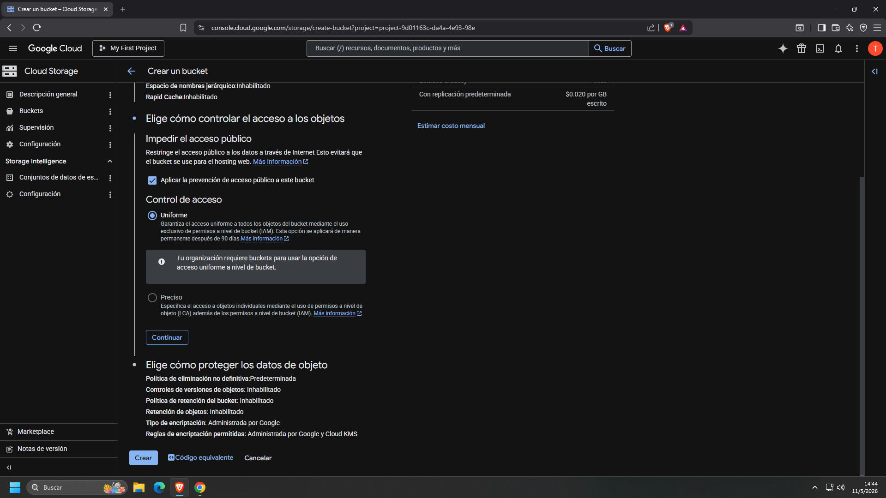 |
| Definición de ubicación multi-región | 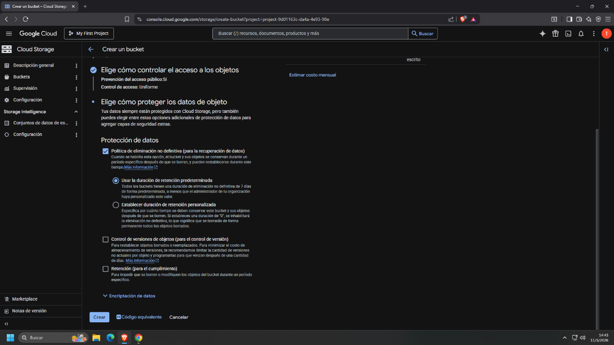 |
| Clase de almacenamiento Standard | 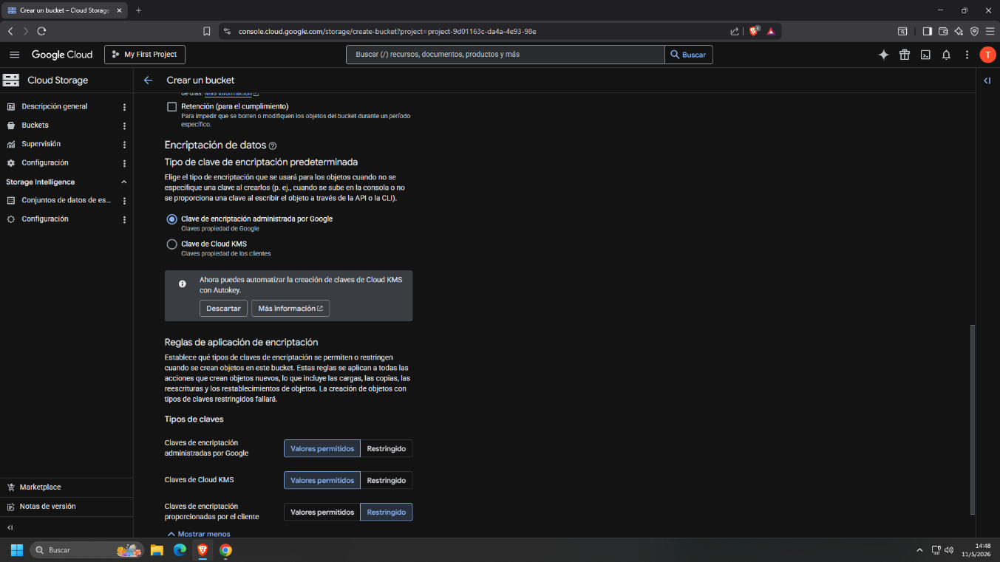 |
| Control de acceso uniforme | 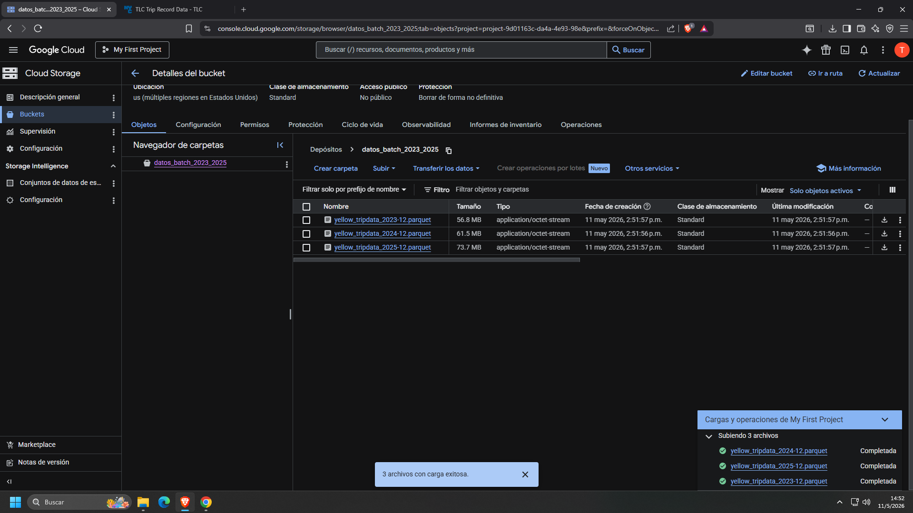 |
| Protección de datos | 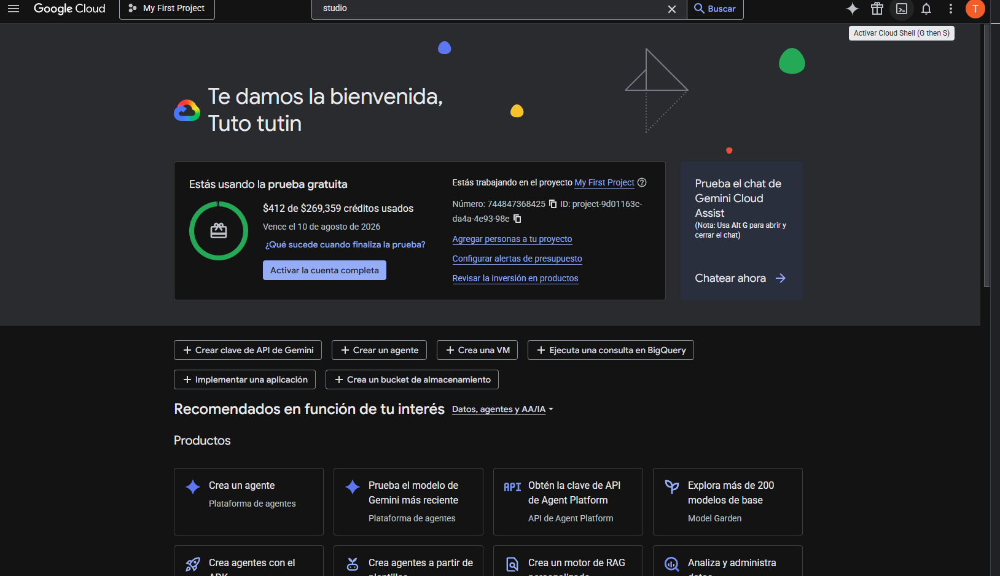 |
| Encriptación | 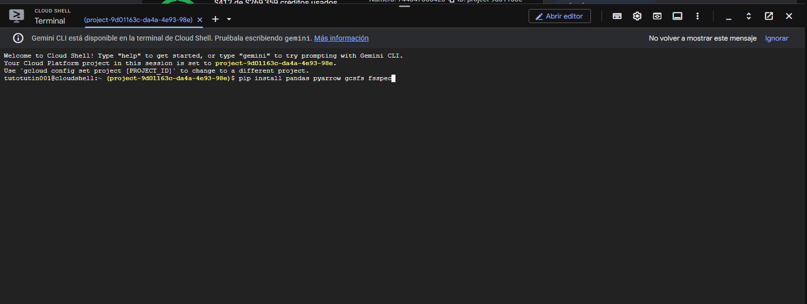 |
| Archivos .parquet cargados | 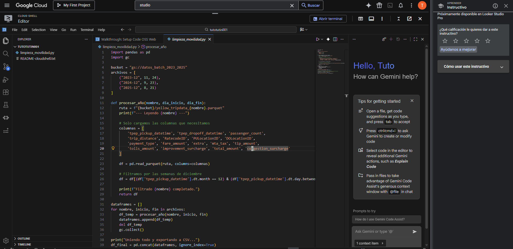 |

---

### 2. Dataflow — Procesamiento ETL

#### 2.1 Preprocesamiento con Python (Cloud Shell)

Se ejecutó un script Python en Cloud Shell que:
1. **Extrae** los archivos `.parquet` desde GCS cargando solo las columnas necesarias
2. **Filtra** los registros de las semanas de diciembre de cada año
3. **Une y exporta** los tres años en un único archivo `diciembre_final.csv`

> Los archivos `.parquet` originales tienen timestamps con milisegundos que Dataflow no puede procesar directamente, por eso se convirtieron primero a CSV.

```bash
pip install pandas pyarrow gcsfs fsspec
python preprocesar_diciembre.py
```

Ver script completo: [`scripts/preprocessing/preprocesar_diciembre.py`](scripts/preprocessing/preprocesar_diciembre.py)

#### 2.2 Permisos IAM

Se asignaron los siguientes roles a la cuenta de servicio de Compute Engine:

- Administrador de almacenamiento
- Editor de Cloud Build
- Editor de datos de BigQuery
- Escritor de Artifact Registry
- Trabajador de Dataflow
- Usuario de trabajo de BigQuery

#### 2.3 Trabajo en Dataflow

Se usó la plantilla oficial **"CSV Files on Cloud Storage to BigQuery"** con la siguiente ruta de origen:

```
gs://datos_batch_2023_2025/procesado/diciembre_final.csv
```

#### 2.4 Transformación SQL en Dataflow

Se aplicó una transformación SQL sobre el stream `PCOLLECTION` para limpiar y seleccionar columnas:

```sql
SELECT
    tpep_pickup_datetime,
    tpep_dropoff_datetime,
    PULocationID,
    DOLocationID,
    store_and_fwd_flag,
    COALESCE(RatecodeID, 99)          AS RatecodeID_limpio,
    fare_amount,
    COALESCE(congestion_surcharge, 0) AS congestion_surcharge_limpio,
    tolls_amount,
    total_amount
FROM PCOLLECTION
```

El destino se configuró en **BigQuery** (dataset `datos_historicos`, tabla `diciembre_yellow_taxi`) con la región `southamerica-west1` (Santiago). El ETL completó en **~13 minutos**.

| Paso | Imagen |
|---|---|
| Activación Cloud Shell | 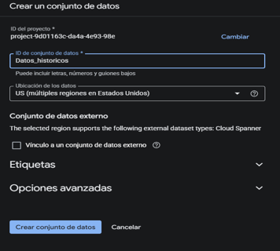 |
| Script Python en editor | 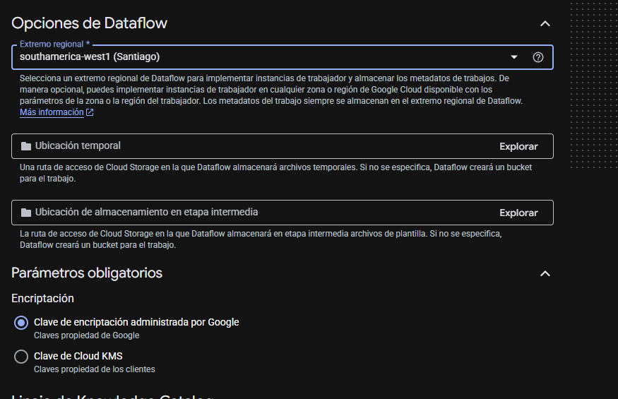 |
| Carpeta `procesado/` creada | 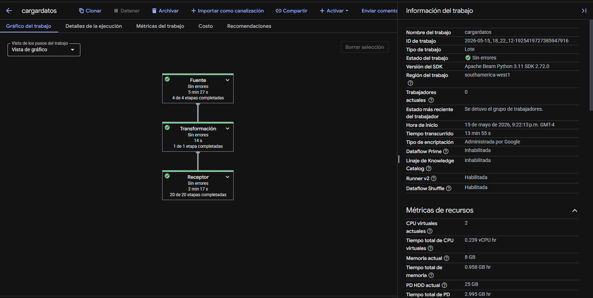 |
| Permisos IAM asignados | 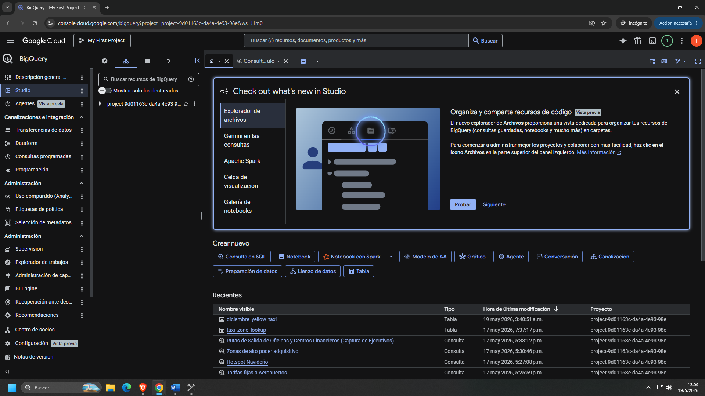 |
| Creación trabajo Dataflow | 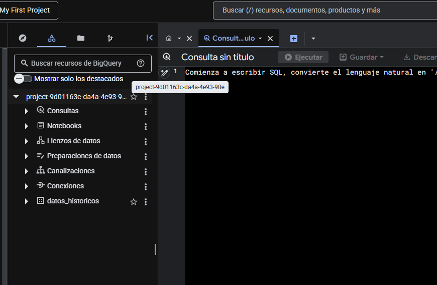 |
| Transformación SQL | 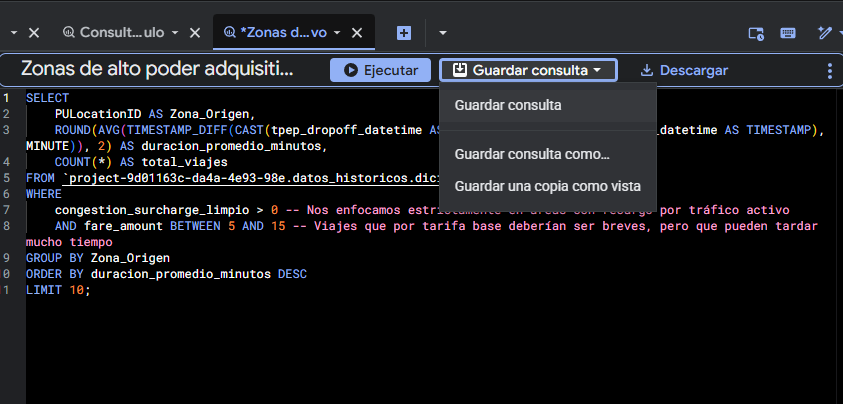 |
| ETL completado exitosamente |  |

---

### 3. BigQuery — Capa de Servicio

Se ejecutaron y guardaron cuatro consultas analíticas sobre `datos_historicos.diciembre_yellow_taxi`:

#### Consulta 1 — Zonas de Alto Poder Adquisitivo

```sql
SELECT
    PULocationID AS Zona_Origen,
    ROUND(AVG(fare_amount), 2)  AS tarifa_base_promedio,
    ROUND(AVG(total_amount), 2) AS gasto_total_promedio,
    COUNT(*) AS cantidad_viajes
FROM `<PROJECT_ID>.datos_historicos.diciembre_yellow_taxi`
WHERE tolls_amount = 0 AND fare_amount > 15
GROUP BY Zona_Origen
HAVING cantidad_viajes > 100
ORDER BY tarifa_base_promedio DESC
LIMIT 10;
```

#### Consulta 2 — Top 10 Viajes Premium (Mayor Gasto)

```sql
SELECT
    PULocationID AS Zona_Origen,
    ROUND(AVG(total_amount), 2) AS costo_promedio,
    ROUND(MAX(total_amount), 2) AS costo_maximo,
    COUNT(*) AS cantidad_viajes
FROM `<PROJECT_ID>.datos_historicos.diciembre_yellow_taxi`
WHERE total_amount > 0
GROUP BY Zona_Origen
HAVING cantidad_viajes > 50
ORDER BY costo_promedio DESC
LIMIT 10;
```

#### Consulta 3 — Tarifas a Aeropuertos

```sql
SELECT
    PULocationID AS Zona_Origen,
    COUNT(*) AS cantidad_viajes_aeropuertos
FROM `<PROJECT_ID>.datos_historicos.diciembre_yellow_taxi`
WHERE RatecodeID_limpio IN (2.0, 3.0)
GROUP BY Zona_Origen
ORDER BY cantidad_viajes_aeropuertos DESC
LIMIT 10;
```

#### Consulta 4 — Hotspot Navideño

```sql
SELECT
    PULocationID AS Zona_Origen,
    COUNT(*) AS total_viajes,
    ROUND(AVG(total_amount), 2) AS tarifa_promedio
FROM `<PROJECT_ID>.datos_historicos.diciembre_yellow_taxi`
WHERE
    EXTRACT(DAY  FROM CAST(tpep_pickup_datetime AS TIMESTAMP)) BETWEEN 10 AND 24
    AND EXTRACT(HOUR FROM CAST(tpep_pickup_datetime AS TIMESTAMP)) BETWEEN 12 AND 21
GROUP BY Zona_Origen
ORDER BY total_viajes DESC
LIMIT 10;
```

Ver todas las consultas en: [`scripts/sql/`](scripts/sql/)

| Consulta | Imagen resultado |
|---|---|
| Zonas alto poder adquisitivo | 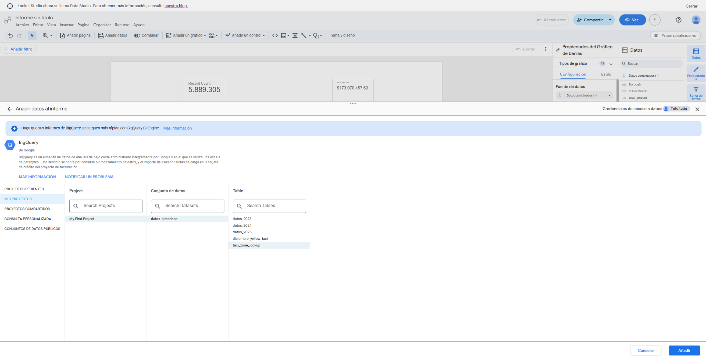 |
| Viajes premium Top 10 | 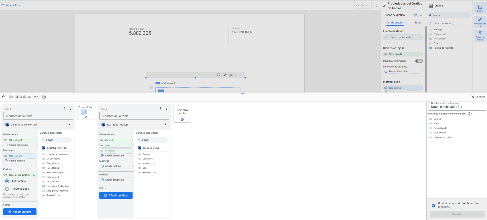 |
| Tarifas aeropuertos | 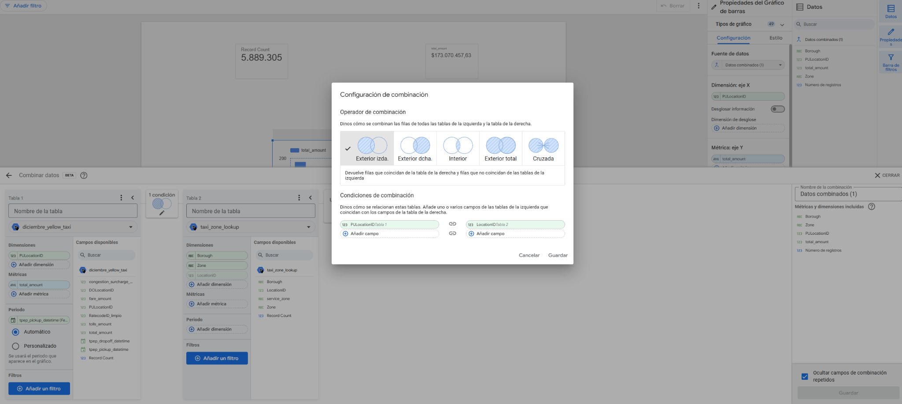 |
| Hotspot navideño | 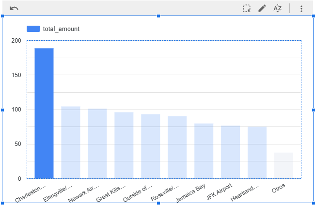 |

---

### 4. Looker Studio — Dashboard Histórico

El dashboard se construyó conectando Looker Studio directamente a la tabla `diciembre_yellow_taxi` en BigQuery.

#### Enriquecimiento de datos
Se descargó el archivo `taxi_zone_lookup.csv` para traducir los `LocationID` numéricos a nombres de barrios y distritos. Se combinaron las tablas en Looker Studio con unión exterior izquierda (`PULocationID` ↔ `LocationID`).

#### Mapa coroplético geoespacial
Para el mapa de calor de zonas de destino se requirió convertir el shapefile de zonas de taxi a formato **WKT** (EPSG:4326) usando [mygeodata.cloud](https://mygeodata.cloud/), cargar la tabla a BigQuery, y usar una **consulta personalizada** para los datos geoespaciales:

```sql
SELECT
    viajes.*,
    ST_GEOGFROMTEXT(geo_destino.WKT) AS poligonos,
    geo_destino.zone AS nombre_destino,
    geo_origen.zone  AS nombre_origen
FROM `<PROJECT_ID>.datos_historicos.diciembre_yellow_taxi` AS viajes
LEFT JOIN `<PROJECT_ID>.datos_historicos.taxi_zone_oficial` AS geo_destino
    ON CAST(viajes.DOLocationID AS STRING) = CAST(geo_destino.LocationID AS STRING)
LEFT JOIN `<PROJECT_ID>.datos_historicos.taxi_zone_oficial` AS geo_origen
    ON CAST(viajes.PULocationID AS STRING) = CAST(geo_origen.LocationID AS STRING)
```

#### Componentes del dashboard

| Componente | Descripción |
|---|---|
| KPI — Viajes totales | `Record Count` |
| KPI — Gasto promedio | `AVG(total_amount)` en USD |
| KPI — Gasto total | `SUM(total_amount)` en USD |
| KPI — Duración promedio | `DATETIME_DIFF(dropoff, pickup, MINUTE)` |
| Gráfico de barras | Top 10 zonas de origen por volumen de viajes |
| Gráfico de líneas | Distribución horaria de demanda (00:00 - 23:00) |
| Gráfico de líneas | Distribución por día de la semana |
| Mapa coroplético | Densidad de destinos por zona geográfica |
| Filtro desplegable | Destino (Top 5 zonas más relevantes) |
| Filtro desplegable | Año (2023 / 2024 / 2025) |

| Vista | Imagen |
|---|---|
| Dashboard completo | 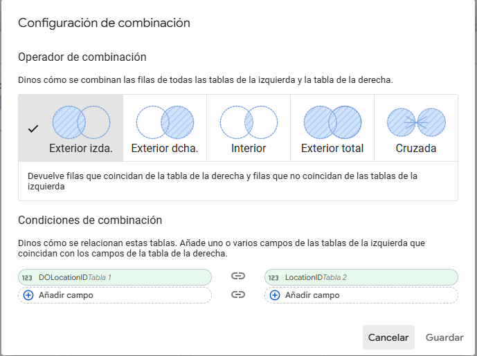 |
| Gráfico zonas premium | 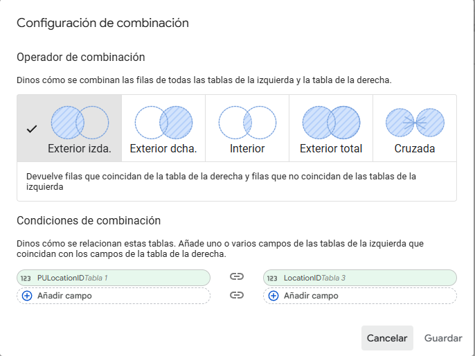 |
| Mapa de calor | 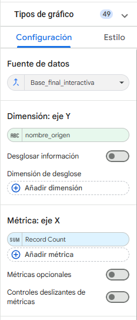 |
| Distribución horaria | 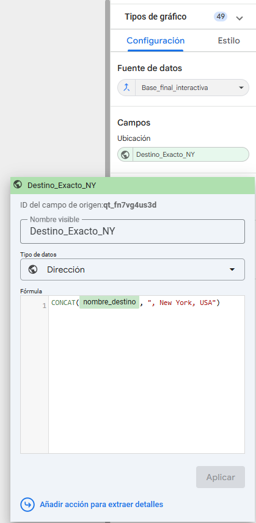 |
| Filtros interactivos | 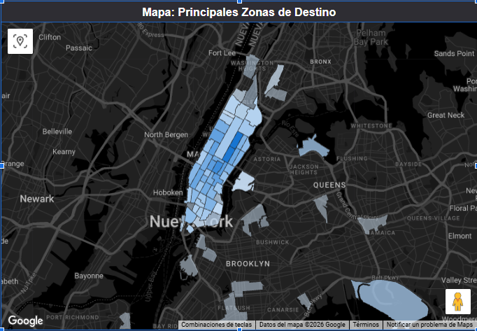 |

Ver todas las capturas en: [`images/looker-studio/`](images/looker-studio/)

**Usuario y valor:** dirigido al **Usuario Ejecutivo** de NYC Mobility Analytics Group (permisos de solo lectura en BigQuery). El ranking de zonas premium y el mapa coroplético responden **dónde** se concentra el gasto; el gráfico de Hotspot Navideño confirma que esas zonas lideran en la ventana crítica de compras; la distribución horaria y semanal define **cuándo** ocurre el pico de actividad; y las tarjetas KPI cuantifican volumen y valor del mercado del trienio.

---

## Implementación — Flujo en Tiempo Real (Streaming)

### 5. Cloud Pub/Sub — Mensajería de Ingesta

Cloud Pub/Sub desacopla al productor (webhook) del consumidor (pipeline Dataflow), absorbe picos de tráfico sin perder mensajes y retiene cada evento hasta su confirmación.

**Paso 1 — Creación del topic:** se crea el topic `registros`, dejando marcada la opción **Agregar una suscripción predeterminada** (genera automáticamente `registros-sub`) y manteniendo la clave de encriptación administrada por Google.

| Paso | Imagen |
|---|---|
| Creación del topic `registros` | 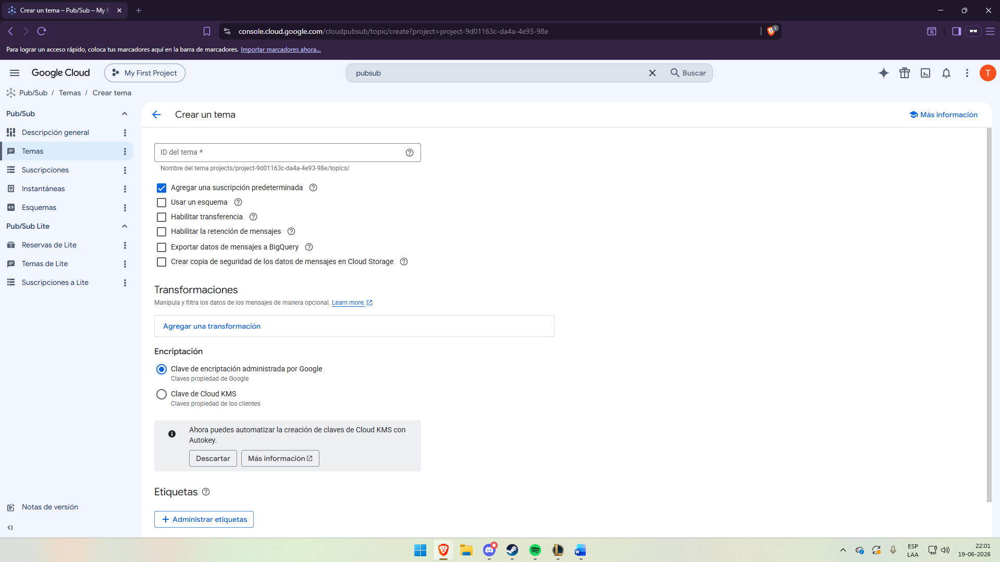 |
| Suscripción `registros-sub` generada | 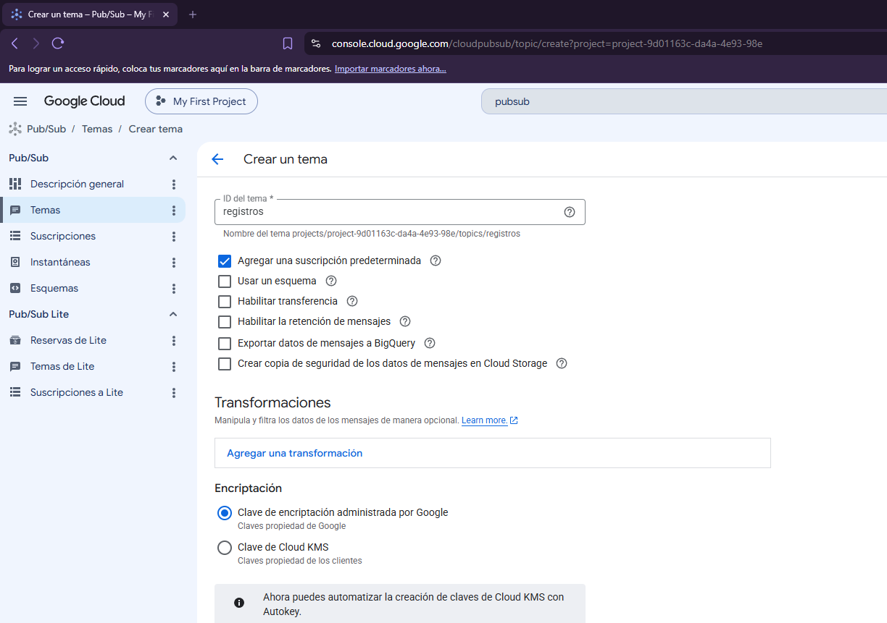 |

---

### 6. Cloud Run — Webhook de Ingesta HTTP

La fuente de eventos (`https://bdrealtimeescuelait.duoc.cl/`) entrega solicitudes **HTTP POST**, no mensajes nativos de Pub/Sub, por lo que se construyó un webhook serverless en Cloud Run (`webhookpubsub`) que valida cada JSON entrante y lo publica en el topic.

**Paso 1 — Despliegue de la función:** se crea con *Write a function*, nombre `webhookpubsub`, región `southamerica-west1` y lenguaje **Python 3.10**.

**Paso 2 — Autenticación:** se marca *Usar Cloud IAM* con **Autenticación obligatoria**, de modo que solo identidades autorizadas puedan invocar el servicio.

**Paso 3 — Parámetros de ejecución:** `Request timeout` en 3600 segundos, máximo 80 solicitudes simultáneas por instancia, entorno *First generation*.

**Paso 4 — Código fuente del webhook:** `main.py` inicializa el cliente de Pub/Sub y publica en el topic `registros` el contenido JSON del cuerpo de cada solicitud; si el cuerpo es una lista, publica cada elemento individualmente; si el JSON es inválido devuelve error 400, y ante excepciones responde error 500.

```python
from google.cloud import pubsub_v1
import json

# Inicializa el cliente de Pub/Sub una vez
publisher = pubsub_v1.PublisherClient()
project_id = "project-9d01163c-da4a-4e93-98e"
topic_id = "registros"
topic_path = publisher.topic_path(project_id, topic_id)


def main(request):
    try:
        # Obtener el JSON desde el body del request
        data = request.get_json()
        if not data:
            return "Solicitud sin JSON válido", 400

        # Convertir a bytes para Pub/Sub
        message_bytes = json.dumps(data).encode("utf-8")

        # Publicar mensaje en Pub/Sub
        # Si es un array, publicar cada uno individualmente
        if isinstance(data, list):
            for item in data:
                message_bytes = json.dumps(item).encode("utf-8")
                future = publisher.publish(topic_path, message_bytes)
                future.result()  # Esperar a que se complete la publicación
        else:
            message_bytes = json.dumps(data).encode("utf-8")
            future = publisher.publish(topic_path, message_bytes)
            future.result()
        return "Completado", 200
    except Exception as e:
        return f"Error al procesar la solicitud: {e}", 500
```

`requirements.txt`:
```
google-cloud-pubsub
functions-framework
google-cloud-bigquery
```

Ver código completo: [`scripts/streaming/main.py`](scripts/streaming/main.py) · [`scripts/streaming/requirements.txt`](scripts/streaming/requirements.txt)

**Paso 5 — Permisos IAM:** se otorga a la cuenta de servicio el rol **Publicador de Pub/Sub**, requisito para que el webhook publique mensajes.

**Paso 6 — Registro de la URL:** se copia la URL del servicio y se registra en el portal de eventos; desde ese momento el portal envía los registros vía POST y el panel de log confirma cada envío con el estado *enviado correctamente*.

| Paso | Imagen |
|---|---|
| Despliegue del webhook (`Write a function`, región, runtime) | 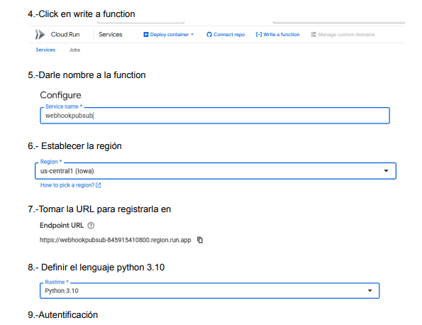 |
| Autenticación obligatoria vía Cloud IAM | 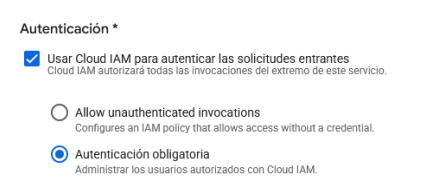 |
| Parámetros de ejecución (timeout, concurrencia) | 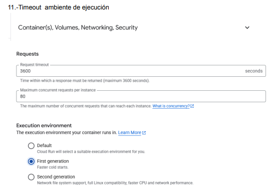 |
| Código fuente `main.py` | 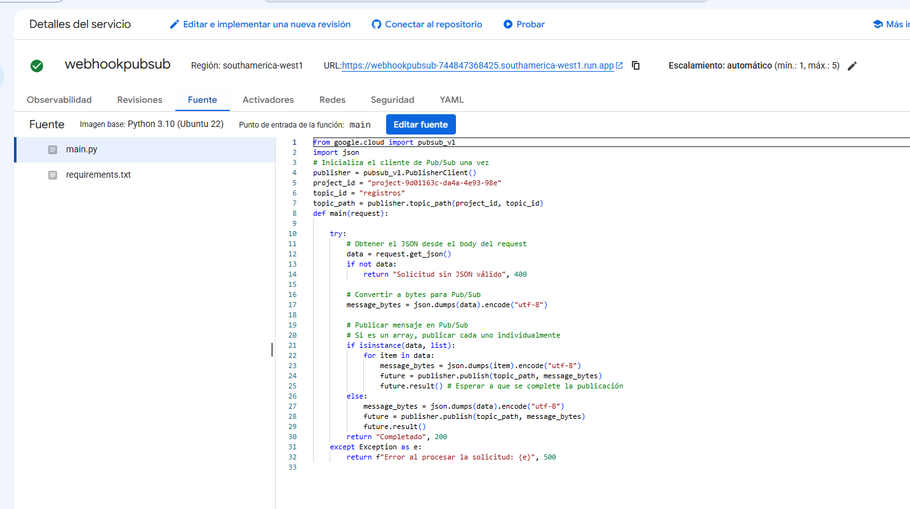 |
| Dependencias `requirements.txt` | 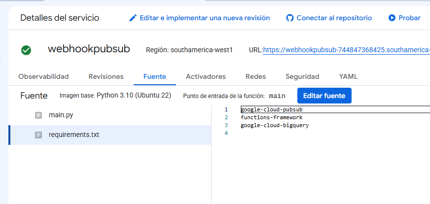 |
| Rol IAM Publicador de Pub/Sub | 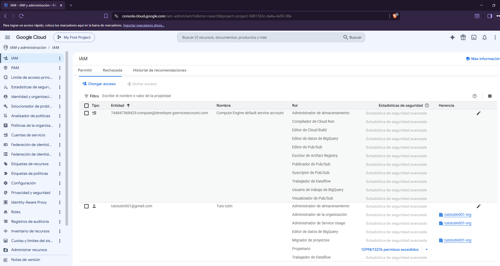 |
| Registro de la URL y log de envíos | 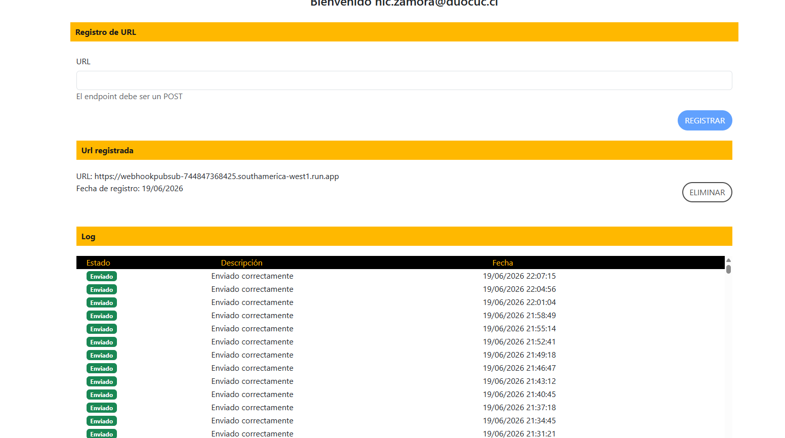 |

---

### 7. Dataflow — Procesamiento Streaming

Se utilizó la plantilla administrada **"Pub/Sub Subscription to BigQuery"**, un pipeline de streaming que lee mensajes JSON desde la suscripción y los escribe en BigQuery.

**Parámetros del trabajo:**

| Parámetro | Valor |
|---|---|
| Nombre del trabajo | `transferbigquery` |
| Extremo regional | `southamerica-west1` (Santiago) |
| Suscripción de entrada | `registros-sub` |
| Tabla de salida | `DatosRealTime.DatosTR` |
| Modo de transmisión | Exactamente una vez (evita duplicados y pérdidas) |
| Streaming Engine | Habilitado |
| Ubicación temporal | `gs://datos_batch_2023_2025/temp/` |
| Dataflow Prime | Deshabilitado |

Al iniciar el trabajo, el pipeline despliega las etapas `ReadPubSubSubscription`, `ConvertMessageToTableRow` y `WriteSuccessfulRecords` (con manejo de errores en `WriteFailedRecords`): cada mensaje JSON se transforma en una fila de tabla y los registros fallidos se aíslan sin detener el flujo.

| Paso | Imagen |
|---|---|
| Configuración del trabajo con la plantilla Pub/Sub to BigQuery | 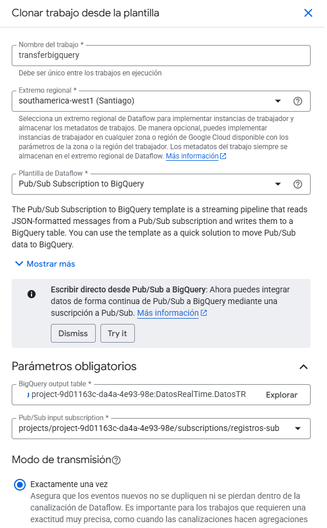 |
| Parámetros de streaming (suscripción, tabla, modo de transmisión) | 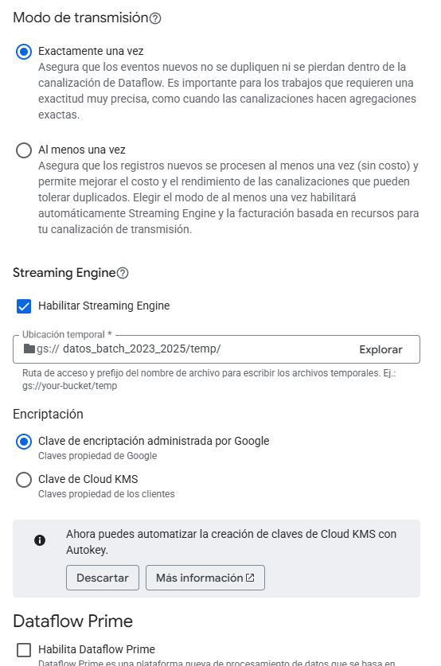 |
| Pipeline en ejecución (Apache Beam SDK for Java 2.74.0) | 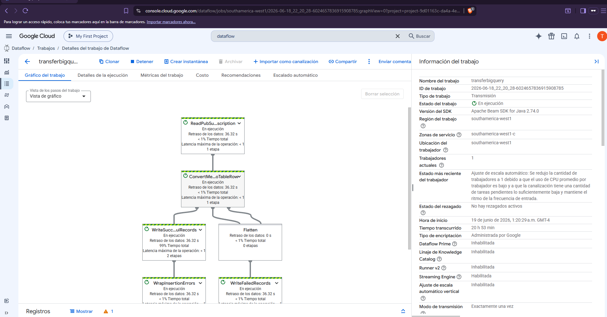 |

---

### 8. BigQuery — Almacenamiento en Tiempo Real

Como destino se creó el dataset **`DatosRealTime`** con la tabla **`DatosTR`**, que recibe los registros de forma continua. La tabla contiene las columnas `id_cliente`, `cliente`, `género`, `id_producto`, `producto`, `precio`, `cantidad`, `monto` y `forma_pago`, con miles de filas cargadas en vivo y disponibles para consulta SQL segundos después de cada transacción. Este dataset convive con `datos_historicos` en el mismo warehouse, unificando la explotación de ambos flujos.

| Paso | Imagen |
|---|---|
| Dataset `DatosRealTime` y tabla `DatosTR` | 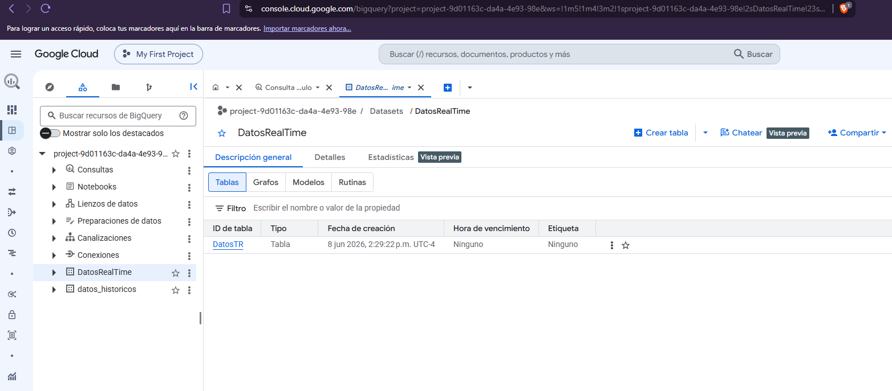 |
| Registros llegando en vivo | 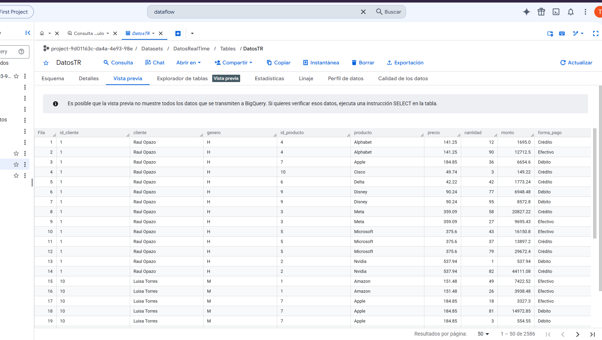 |

---

### 9. Looker Studio — Dashboard en Tiempo Real

El dashboard en vivo se construyó en Looker Studio conectado directamente a la tabla `DatosTR`.

| Componente | Configuración |
|---|---|
| Scorecard — Ingresos Navideños | Campo `monto` (suma) — ingresos acumulados de las subastas |
| Scorecard — Clientes | `Record Count` — cantidad de clientes que han transaccionado |
| Scorecard — Regalos Vendidos | Campo `cantidad` (suma) — total de productos vendidos |
| Scorecard — Ticket Promedio | Campo `monto` (media) — gasto promedio por transacción |
| Gráfico de barras — Top Regalos | Dimensión `producto`, métrica `cantidad` |
| Gráfico de líneas — Días Pico | Dimensión `fecreg`, métrica `Record Count` |
| Gráfico de barras apiladas | `producto` × `género`, métrica `Record Count` |
| Gráfico circular — Forma de Pago | Dimensión `forma_pago`, métrica `Record Count` |

| Paso | Imagen |
|---|---|
| Tarjetas de resultado (scorecards) | 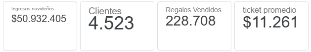 |
| Configuración Ingresos Navideños / Ticket Promedio | 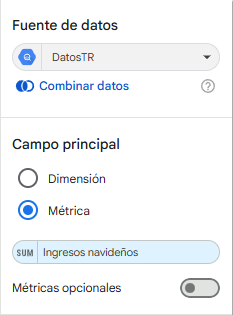 |
| Configuración Clientes / Regalos Vendidos | 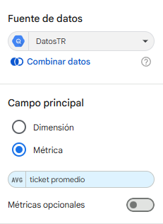 |
| Top Regalos (barras) | 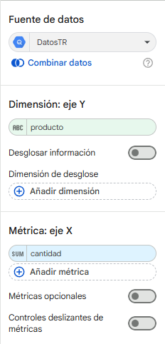 |
| Días pico (líneas) | 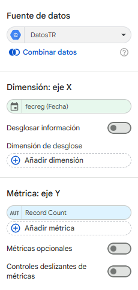 |
| Distribución por género (barras apiladas) | 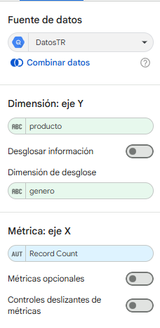 |
| Forma de pago (circular) | 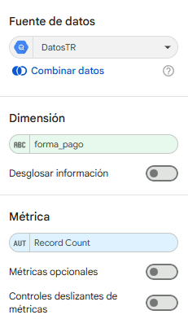 |
| Dashboard en vivo completo | 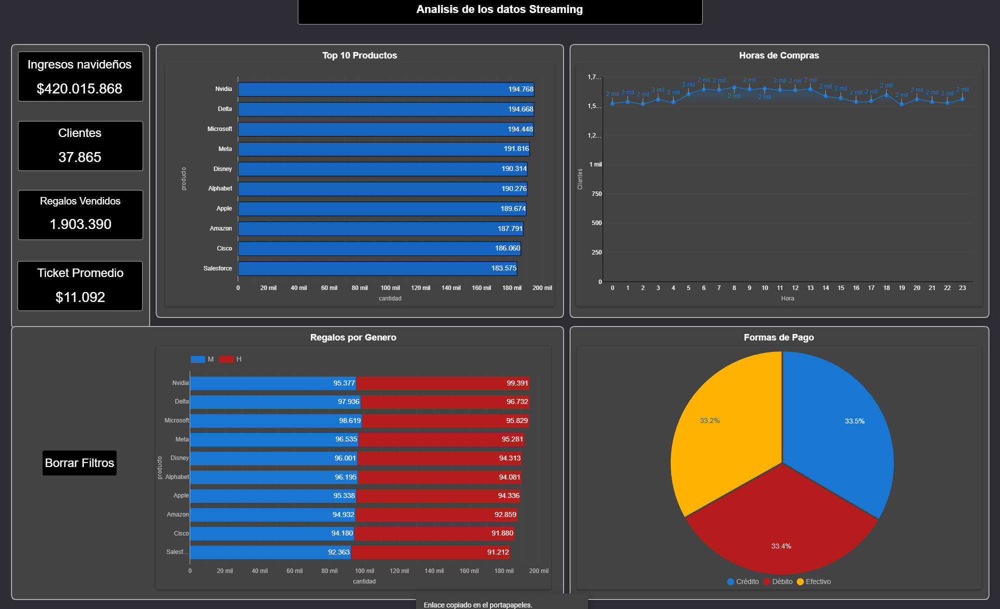 |

**Usuario y valor:** dirigido al **equipo comercial y de operaciones** de campañas, responsable de decidir cuándo y hacia dónde activar la publicidad. Mientras el flujo histórico entrega el **dónde** (Hotspots Premium), este dashboard entrega el **cuándo**: el gatillo temporal exacto para impactar con la campaña, validando en tiempo casi real si el mercado está activo y receptivo.

---

## Gobierno de Datos

### Calidad de Datos — Consistencia, Exactitud e Integridad

- **Consistencia:** el script de preprocesamiento y el ETL de Dataflow uniforman los formatos de fecha y hora de los tres años (2023-2025), resolviendo la incompatibilidad de timestamps con milisegundos.
- **Exactitud:** la transformación SQL elimina valores atípicos y normaliza códigos mediante `COALESCE` (`RatecodeID` nulo → 99; `congestion_surcharge` nulo → 0).
- **Integridad:** solo se cargan registros con zonas de origen/destino válidas; en streaming el webhook valida el JSON entrante (error 400 si es inválido) y el modo *Exactamente una vez* de Dataflow impide duplicados y pérdidas.

### Seguridad de Datos — Control de Acceso y Cifrado

- **Control de acceso:** principio de mínimo privilegio vía IAM, con dos perfiles: **Usuario Técnico** (escritura en Cloud Storage, Dataflow y BigQuery) y **Usuario Ejecutivo** (solo lectura de resultados en BigQuery). La cuenta de servicio del webhook recibe únicamente el rol *Publicador de Pub/Sub*, y Cloud Run exige autenticación obligatoria vía Cloud IAM. El bucket usa acceso uniforme e impide el acceso público.
- **Cifrado:** AES-256 en reposo (claves administradas por Google en el bucket y en el topic de Pub/Sub) y TLS en tránsito entre todas las herramientas de la arquitectura, con anonimización grupal alineada a **ISO-27001**.

### Gestión de Datos — Retención y Auditoría

- **Retención:** los archivos crudos en Cloud Storage migran a clase **Coldline** tras 90 días de inactividad; política de eliminación no definitiva de 7 días; los mensajes de Pub/Sub retienen máximo 7 días hasta su confirmación; los resultados en BigQuery permanecen activos durante todo el trienio del proyecto.
- **Auditoría:** **Cloud Audit Logs** registra cada acción sobre los datos (quién consulta, qué pesa y qué filtros usa), entregando trazabilidad completa sobre la actividad del Usuario Ejecutivo.

### Ciclo de Vida del Dato

| Fase | Implementación |
|---|---|
| Creación | Sistema TLC Yellow Taxi (viajes) y portal de subastas en vivo (transacciones POST) |
| Ingesta | Carga manual de `.parquet` al bucket (batch); webhook de Cloud Run que publica en Pub/Sub (streaming) |
| Clasificación | Organización por año/mes en el bucket (Landing Zone); datasets separados en BigQuery (`datos_historicos` / `DatosRealTime`) |
| Almacenamiento | Cloud Storage como Master Dataset inmutable; BigQuery como warehouse analítico de ambos flujos |
| Transformación | Script Python de filtrado/unión y SQL con `COALESCE` (batch); `ConvertMessageToTableRow` (streaming) |
| Uso / Explotación | Consultas SQL guardadas y los dos dashboards de Looker Studio (histórico y en vivo) |
| Retención y Eliminación | Migración a Coldline (90 días), retención de 7 días en Pub/Sub, eliminación programada al cierre del trienio |

---

## Análisis de Arquitecturas

### Arquitectura de Referencia (Modelo Lambda)

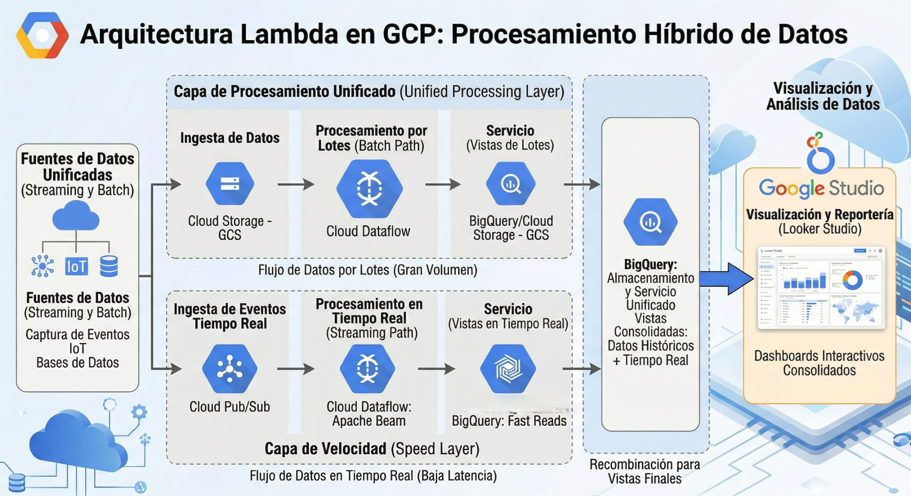

Se seleccionó el **modelo Lambda** como arquitectura de referencia porque el proyecto exige dos capacidades simultáneas: el análisis masivo del histórico 2023-2025 (**Capa de Lotes**, cubierta por Dataflow y BigQuery) y un sistema preparado para recibir datos en tiempo real sin rediseñar la estructura entre etapas (**Capa de Velocidad**, con Pub/Sub como punto de entrada). La **Capa de Servicio** unifica los resultados de ambas rutas en BigQuery como único punto de consulta.

### Arquitectura Final — Componentes Adicionales

Al contrastar la arquitectura final implementada con el modelo Lambda de referencia, se incorporaron componentes que la referencia no cubre:

- **Webhook en Cloud Run (adaptador de ingesta HTTP):** el modelo Lambda no especifica cómo llegan los eventos hasta la mensajería. La fuente entrega HTTP POST, no mensajes nativos de Pub/Sub, por lo que fue necesario un servicio intermedio (`webhookpubsub`) que expone una URL autenticada, valida el JSON entrante y lo traduce a mensajes del topic.
- **Integración con el portal externo de registro:** el registro de la URL del servicio en el portal de eventos (con su panel de log de envíos) constituye un acuerdo de integración punto a punto con un sistema de terceros, no contemplado por la referencia.
- **Capa de visualización (Looker Studio):** el modelo Lambda termina en la Capa de Servicio (datos consultables). Los dashboards interactivos, mapas coropléticos, KPIs y controles cruzados son una extensión de explotación para el usuario final más allá de lo definido por la referencia.
- **Gobernanza transversal y servicios administrados:** IAM de mínimo privilegio, autenticación obligatoria del webhook, cifrado AES-256/TLS, Cloud Audit Logs y políticas de retención (Coldline, eliminación no definitiva) atraviesan todas las capas pero no forman parte del modelo Lambda, que es un patrón de procesamiento y no de gobierno. El uso de plantillas administradas de Dataflow (*CSV to BigQuery* y *Pub/Sub Subscription to BigQuery*) es una decisión de implementación propia del ecosistema GCP.

---

## Propuesta de Valor

**Garantizamos a nuestro cliente que la publicidad de sus subastas de productos electrónicos no circulará al azar.**

El flujo **Batch** responde el **dónde**: mediante el análisis de movilidad histórica, identificamos las zonas geográficas donde transita el segmento de mayor disposición a pagar, los horarios óptimos de mayor densidad del público objetivo, los días críticos de la temporada navideña y los corredores aeroportuarios frecuentados por ejecutivos y viajeros de negocios.

El flujo **Streaming** responde el **cuándo**: el dashboard en tiempo real actúa como validador térmico de los Hotspots — cuando los indicadores detectan un pico transaccional, el sistema confirma que el mercado está activo y receptivo en ese preciso segundo, habilitando el enrutamiento publicitario dinámico hacia las pantallas de la flota.

El resultado es un **sistema de enrutamiento inteligente** que combina inteligencia histórica y validación en vivo para dirigir la flota de taxis publicitarios exactamente hacia los hotspots premium en el momento de mayor receptividad, maximizando la visibilidad ante el comprador correcto y elevando el retorno de inversión de la campaña.

---

## Tecnologías Utilizadas


- **Google Cloud Storage** — Datalake / almacenamiento de archivos Parquet
- **Google Cloud Pub/Sub** — Mensajería de ingesta en tiempo real
- **Google Cloud Run** — Webhook serverless de ingesta HTTP (`webhookpubsub`)
- **Google Cloud Dataflow** — ETL distribuido batch y streaming (Apache Beam)
- **Google BigQuery** — Data Warehouse y motor de consultas SQL
- **Google Looker Studio** — Visualización y dashboards interactivos (histórico y en vivo)
- **Python / Pandas / PyArrow** — Preprocesamiento de datos batch
- **Python (Cloud Run Functions)** — Webhook de ingesta streaming
- **SQL** — Transformaciones y análisis analítico
